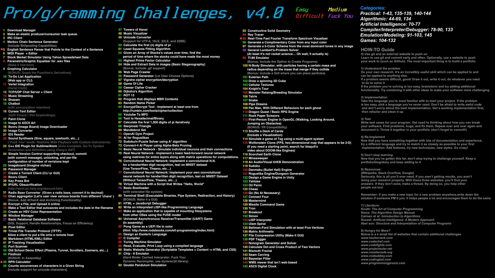
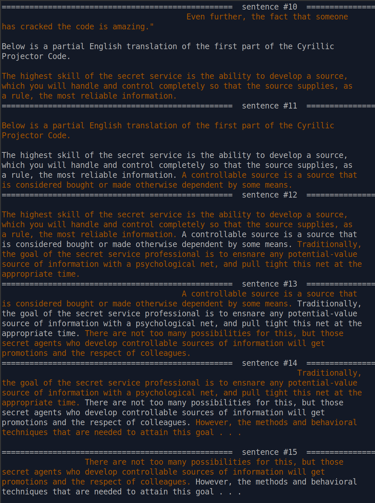
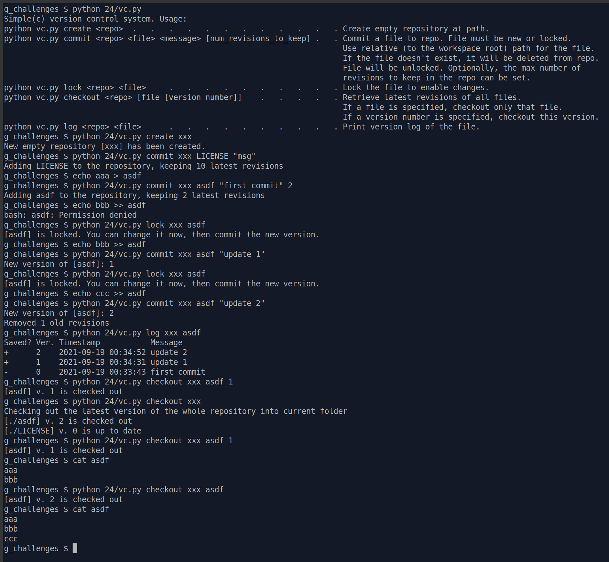
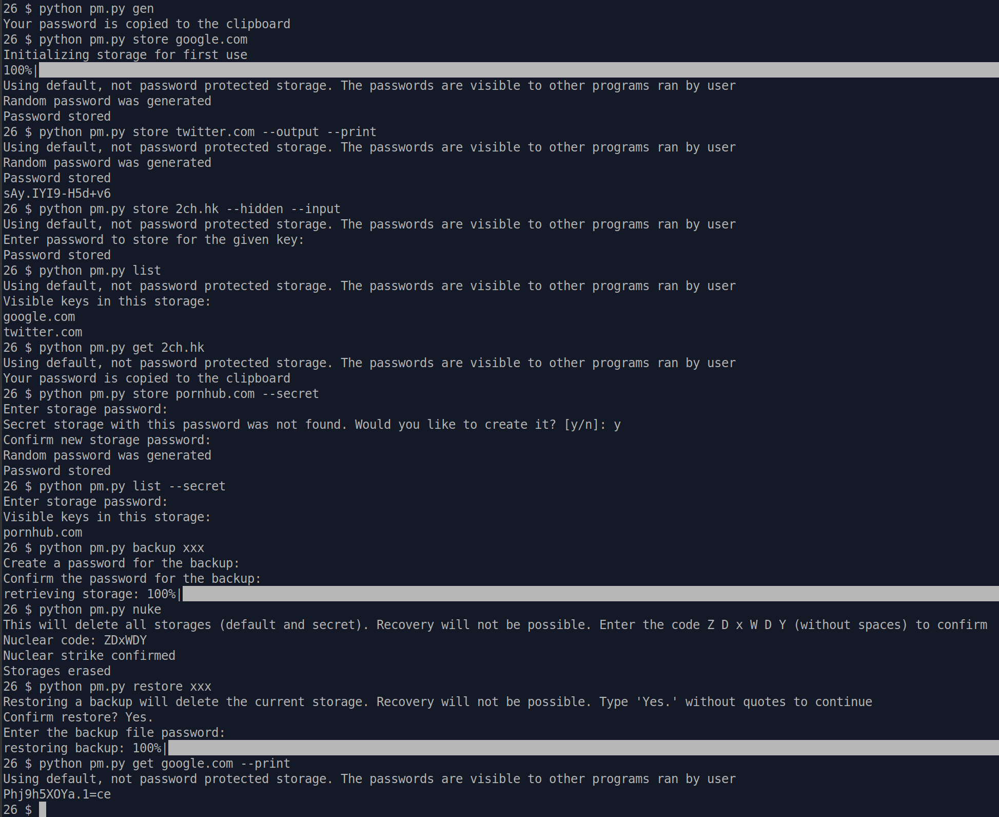
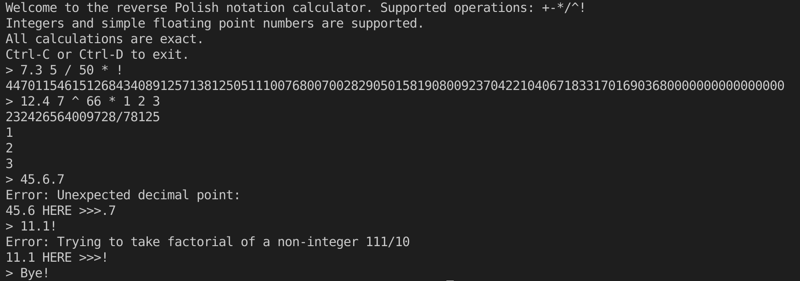
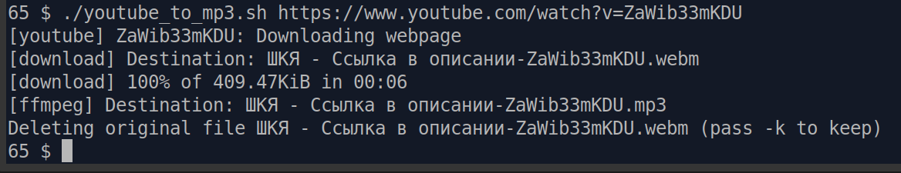
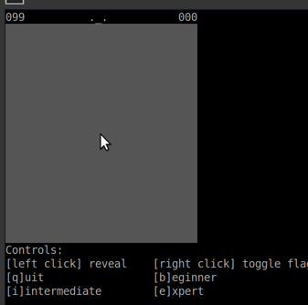

## Here I will post my solutions to the challenges.

## 5. English sentence parser that points to the context of a sentence
Used Stanza to segment the sentences and output them together with the previous and next sentences.

## 24. Simple version control supporting checkout, commit, unlocking, config of number of revisions kept
A poor man's version control. Per-file versions. File needs to be locked to modify.

## 26. Password manager
Fully functional local password manager featuring: secure password generation with obligatory character class requirements (at least one lowercase, uppercase, digit, special character...), storage in the keyring (passwords not recoverable without login), obfuscation (protects agains automatic scans), master password protection (protects against targeted scans), hidden storages with plausible deniability, encrypted backups.

## 45. RPN calculator

## 65. Youtube to MP3
pip install youtube-dl

## 91. CHIP-8 emulator
Works in the terminal.

   

## 95. Real-time FFT spectum visualizer
Works in browser and shows the spectrum of a microphone input + 100 steps of history.
Try it here: [live demo](https://sorrge.github.io/fft_visualizer.html)

## 117. Minesweeper
Console minesweeper. Mouse controls. Mild automation - puts obvious flags by clicking on numbers

