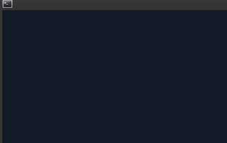

## Here I will post my solutions to the challenges.

## 5. English sentence parser that points to the context of a sentence
Used Stanza to segment the sentences and output them together with the previous and next sentences.

## 45. RPN calculator

## 91. CHIP-8 emulator
Works in the terminal.

   

## 95. Real-time FFT spectum visualizer
Works in browser and shows the spectrum of a microphone input + 100 steps of history.
Try it here: [live demo](https://sorrge.github.io/fft_visualizer.html)

